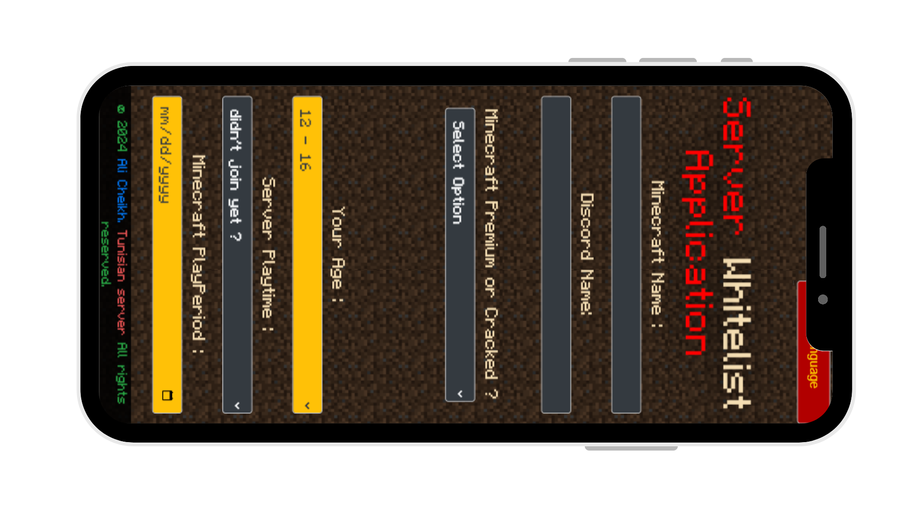

# Server Whitelist Application

Server Whitelist Application is a web form designed for users to apply for whitelisting on a Minecraft server.

## Features

- **User-friendly Interface**: Easy-to-use form for submitting whitelist applications.
- **Responsive Design**: Works seamlessly across various devices.
- **Acceptance of Rules**: Includes a checkbox to confirm the acceptance of server rules.
- **Additional Information**: Allows users to provide additional information along with their application.

## Technologies Used

  
  
  
  
  
  
  
  
  

## Usage

1. Fill out the form with your Minecraft username, Discord name, server playtime, etc.
2. Accept the server rules by clicking on the appropriate checkbox.
3. Click the "SUBMIT" button to submit your application.
4. Upon successful submission, you'll receive a success message.

## Contact Information

- **Discord**: [Ali Cheikh](https://discord.gg/jRbrRwEzjH)
- **Planet Minecraft**: YourPlanetMinecraftName
- **Email**: example@example.com

## Support

  

- [FAQs](#)
- [Terms of Service](#)
- [Privacy Policy](#)

## Donate

Support the server by donating! [Donate Now](src/payto.pdf)

---

© 2024 [Ali Cheikh](bit.ly/Aliportfolio). Tunisian server. All rights reserved.
